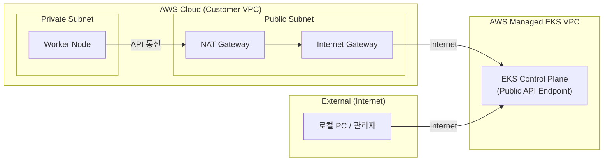
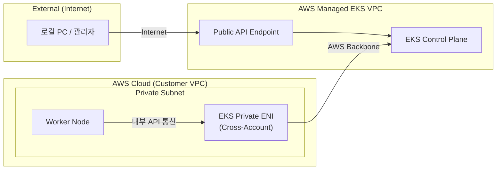
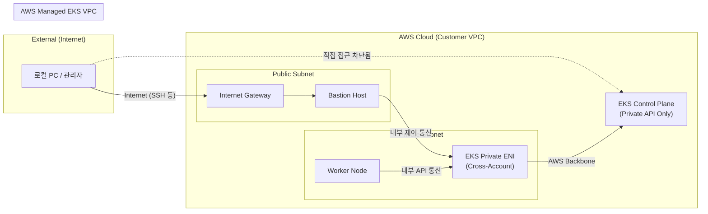

# Amazon EKS 클러스터 엔드포인트 제어 아키텍처 요약 및 실습

EKS 클러스터의 API 서버(Control Plane)에 접근하는 엔드포인트 방식은 보안 요구사항과 운영 편의성을 고려해 3가지로 나눌 수 있습니다. 각 아키텍처의 이론과 네트워크 경로 차이, 인프라 구성 코드, 실습 환경에서의 검증 방법을 아래에 상세히 정리했습니다.

---

## 1. 퍼블릭 엔드포인트 (Public Endpoint Only)

### 📖 이론 및 네트워크 경로
가장 직관적이고 접근 방식이 간단한 옵션입니다. 클러스터 API 서버가 외부에 노출되며, 관리자의 데스크탑이나 외부 장비에서 언제든 통신이 가능합니다.
하지만 내부의 노드조차도 제어 평면과 통신하기 위해 무조건 퍼블릭 인터넷(아웃바운드)을 타야 하므로, 대규모 트래픽 발생 시 NAT Gateway 비용과 네트워크 레이턴시가 증가할 수 있습니다.



### 💻 핵심 인프라 코드 (`public/eks.tf`)
```hcl
module "eks" {
  endpoint_public_access = true
  endpoint_private_access = false
  # 보안 강화를 위해 특정 공인 IP 대역만 접근을 허용할 수 있습니다.
  # endpoint_public_access_cidrs = ["내_로컬_공인IP/32"]
}
```

### 🚀 접속 방법 및 네트워크 검증 실습
- **접근 방법:** 외부 터미널에서 `aws eks update-kubeconfig`를 통해 직접 접속이 가능합니다.
- **네트워크 경로 검증 (로컬 및 워커 노드 테스트):**
  EKS 도메인에 대해 Public IP가 반환되는지 확인합니다.
  ```bash
  # 1. API 서버 엔드포인트 주소 확인
  aws eks describe-cluster --name <클러스터명> --query "cluster.endpoint" --output text
  
  # 2. DNS 쿼리를 통한 IP 확인 (로컬 & 워커 노드 동일 결과)
  dig +short <API서버_도메인>
  # (출력 결과 예시: 3.3.3.3 등 AWS Public IP 반환)
  ```

#### 💡 실제 생성 후 테스트 결과 (보안을 위해 마스킹 처리됨)
```text
--- 1. Updating Kubeconfig ---
❯ aws eks update-kubeconfig --region ap-northeast-2 --name test-cluster
Added new context arn:aws:eks:ap-northeast-2:**********:cluster/test-cluster to ~/.kube/config

--- 2. Checking Nodes ---
❯ kubectl get nodes -o wide
NAME                                               STATUS   ROLES    AGE     VERSION               INTERNAL-IP     EXTERNAL-IP      
ip-192-168-1-199.ap-northeast-2.compute.internal   Ready    <none>   3m      v1.34.4-eks-f69f56f   192.168.1.199   13.125.***.**    
ip-192-168-2-70.ap-northeast-2.compute.internal    Ready    <none>   3m      v1.34.4-eks-f69f56f   192.168.2.70    43.203.***.***   

--- 3. Checking API Server Endpoint DNS Resolution ---
❯ dig +short ********************************.gr7.ap-northeast-2.eks.amazonaws.com
3.39.**.***
3.37.**.***
```

---

## 2. 퍼블릭 & 프라이빗 혼합 환경 (Public & Private Endpoints)

### 📖 이론 및 네트워크 경로
프로덕션(상용) 환경에서 가장 널리 권장되는 구성입니다. 클러스터 생성 시 EKS가 고객의 VPC 내부에 **프라이빗 접속용 네트워크 인터페이스(Cross-Account ENI)**를 주입합니다. Amazon 제공 DNS(Route 53 Resolver)가 알아서 내부/외부 쿼리를 능동적으로 분기(Split-Horizon DNS)합니다.



### 💻 핵심 인프라 코드 (`public-private/eks.tf`)
```hcl
module "eks" {
  endpoint_public_access = true
  endpoint_private_access = true
}
```

### 🚀 접속 방법 및 네트워크 검증 실습
- **네트워크 경로 분기 검증 (Split Horizon DNS):**
  ```bash
  # 1. 로컬 PC에서 DNS 확인 (외부 인터넷)
  dig +short <API서버_도메인>
  # 결과: 외부 Public IP가 반환됨 (예: 54.x.x.x)

  # 2. Bastion이나 워커 노드 접속 후 DNS 확인 (VPC 내부망)
  dig +short <API서버_도메인>
  # 결과: VPC 내부 Private IP가 반환됨 (예: 192.168.x.x -> Cross-Account ENI 주소)
  ```

#### 💡 실제 생성 후 테스트 결과 (보안을 위해 마스킹 처리됨)
```text
--- 1. Node Status ---
❯ kubectl get nodes -o wide
NAME                                               STATUS   ROLES    AGE     VERSION               INTERNAL-IP     EXTERNAL-IP    
ip-192-168-2-104.ap-northeast-2.compute.internal   Ready    <none>   3m      v1.34.4-eks-f69f56f   192.168.2.104   3.38.***.***   
ip-192-168-3-191.ap-northeast-2.compute.internal   Ready    <none>   3m      v1.34.4-eks-f69f56f   192.168.3.191   3.35.**.***    

--- 2. Direct DNS Resolution (Local PC / Public) ---
❯ dig +short ********************************.gr7.ap-northeast-2.eks.amazonaws.com
3.39.***.**
3.36.***.**

--- 3. Internal DNS Resolution (Inside Pod / Private) ---
❯ kubectl run bb-test --rm -i --image=busybox -- nslookup ********************************.gr7.ap-northeast-2.eks.amazonaws.com
Server:		10.100.0.10
Address:	10.100.0.10:53

Non-authoritative answer:
Name:	********************************.gr7.ap-northeast-2.eks.amazonaws.com
Address: 192.168.1.118
Name:	********************************.gr7.ap-northeast-2.eks.amazonaws.com
Address: 192.168.2.17
```

---

## 3. 프라이빗 전용 폐쇄망 환경 (Private Endpoint Only)

### 📖 이론 및 네트워크 경로
가장 높은 수준의 망분리 보안이 요구되는 폐쇄망 환경에서 쓰입니다. 퍼블릭 API 게이트웨이가 아예 비활성화되며, 외부의 악의적인 접근을 원천 차단합니다. 오로지 VPC 내부망의 ENI를 거쳐야만 Control Plane과 대화할 수 있습니다.



### 💻 핵심 인프라 코드 (`private/eks.tf`)
```hcl
module "eks" {
  endpoint_public_access = false
  endpoint_private_access = true
}
```

### 🚀 접속 방법 및 네트워크 검증 실습
직접 접근이 차단되므로 VPC 내에 위치한 점프 호스트(Bastion)를 활용하여 접근해야 합니다.
- **차단 및 우회 통신 검증:**
  ```bash
  # 1. 로컬 PC에서 API 호출 시도 (퍼블릭 접근 차단)
  curl -k -m 5 https://<API서버_도메인>/version
  # 결과: Connection timeout 에러 발생 (접근 불가)

  # 2. VPC 내부 Bastion 서버에 접속 후 API 호출 시도 (프라이빗 접근 성공)
  ssh -i "kp.pem" ubuntu@<Bastion-Public-IP>
  curl -k https://<API서버_도메인>/version
  # 결과: JSON 포맷의 Kubernetes 버전 정보 출력됨
  
  # 3. 내부망 DNS 확인
  dig +short <API서버_도메인>
  # 결과: VPC 내부 Private IP(ENI 주소)만 반환됨
  ```

#### 💡 실제 생성 후 테스트 결과 (보안을 위해 마스킹 처리됨)
```text
--- 1. Testing Local PC Access (Expected to Fail) ---
❯ curl -k -m 5 https://********************************.yl4.ap-northeast-2.eks.amazonaws.com/version
curl: (28) Connection timed out after 5002 milliseconds

--- 2. Checking Nodes from Bastion (Inside VPC) ---
❯ ssh -i chjung0319.pem ubuntu@Bastion-IP
ubuntu@bastion:~$ kubectl get nodes -o wide
NAME                                               STATUS   ROLES    AGE     VERSION               INTERNAL-IP     EXTERNAL-IP    
ip-192-168-1-145.ap-northeast-2.compute.internal   Ready    <none>   5m      v1.34.4-eks-f69f56f   192.168.1.145   3.34.***.**    
ip-192-168-2-7.ap-northeast-2.compute.internal     Ready    <none>   5m      v1.34.4-eks-f69f56f   192.168.2.7     15.164.***.*** 

--- 3. Direct DNS Resolution from Bastion (Inside VPC) ---
ubuntu@bastion:~$ dig +short ********************************.yl4.ap-northeast-2.eks.amazonaws.com
192.168.3.156
192.168.2.84
```
